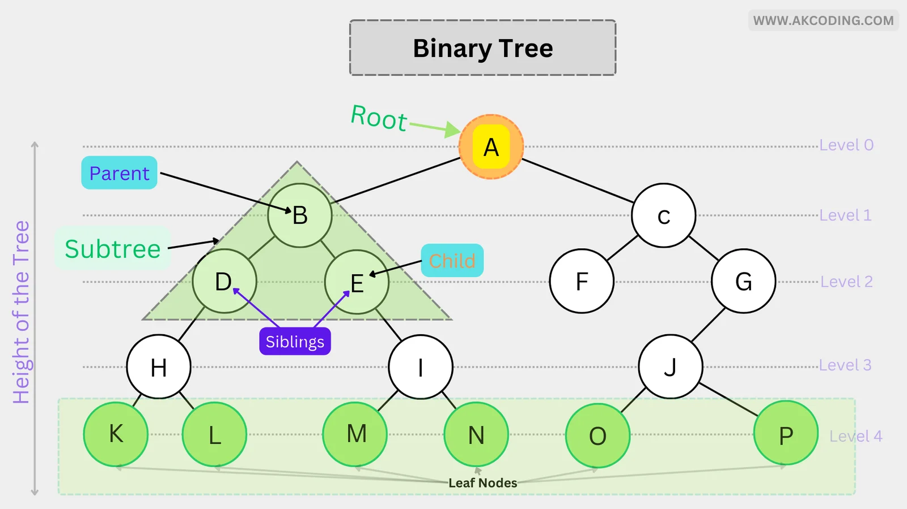
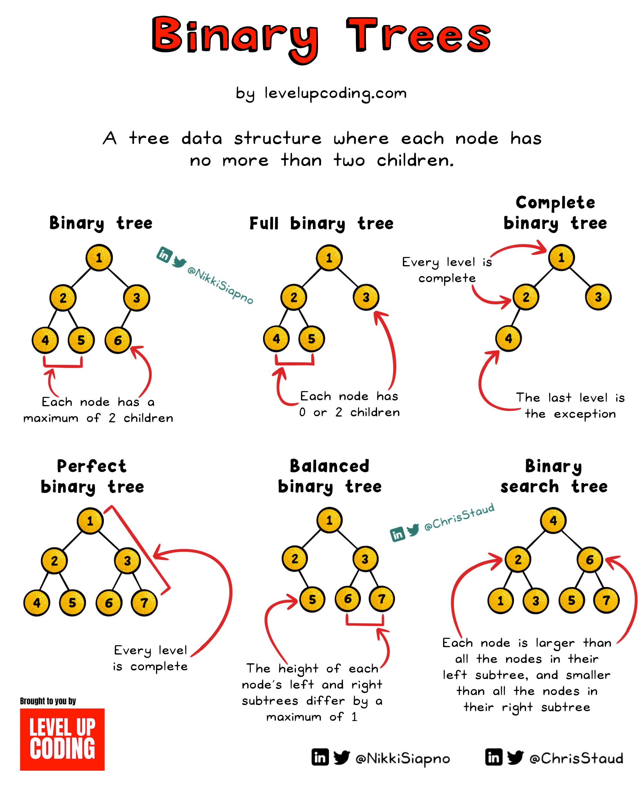

# Tree

A data structure which stores the data in the hierrachical manner is called "Tree".

## Types

* Binary Tree
* Binary Search Tree
* N-array Tree

## Binary Tree

A tree where node can have maximum of 2 children.

### Types of Binary Tree

#### Full BT

All nodes must have 2 or 0 children

#### Complete BT

* All levels must be completely filled except the last level.
* The last levels has all nodes in left as possible.

#### Perfect BT

* All leaf nodes are at the same level.
* All non leaf nodes must have 2 children.

#### Balanced BT

* Height difference between left and right subtree ar any node must be a maximum of 1.

#### Degenerate BT

### Traversal Techniques

#### Inorder Traversal 

* Left->Root->Right
* Time Complexity : O(N) --> Because it has to traverse all the nodes
* Space Complexity : O(1ogN) --> Incase of Balanced Binary Tree, O(N) in worst case

#### Preorder Travesal - Root->Left->Right

#### Postorder Traversal - Left->Right->Root

