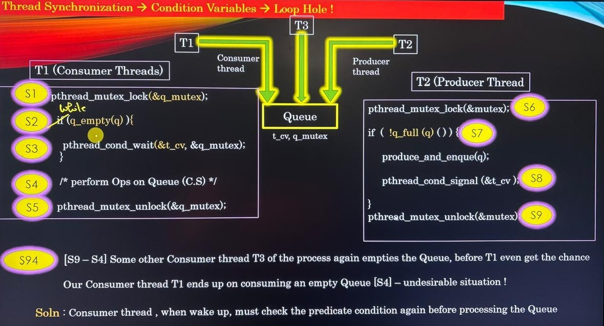

# Compilation of pthreads

*   Ex :  gcc -pthread main.c -o main

## API's

*   **pthread_create()**
    *   Syntax : 
    ```bash
    pthread_create(thread, attr, routine, arg).
    ```
    *   To create a new thread

*   **pause()**
    *   It will stop the execution of the main thread and wait for child threads to finish execution. 
    *   Inother words it suspends the calling process until a signal is caught.

*   **pthread_join()**
    *   It will halt the execution of the main thread and wait for child thread to thread join the main thread. Continues execution of the main thread where it left halt. If child thread didnt join the main thread then the child thread resources wont be freed.
    *   Inother words it waits for a specific thread to terminate (in a multithreaded program).

*   **pthread_detach()**
    *   It creates a detached thread where the thread wont have to join the main thread, it can run and die without returning to any thread. Once died its resources are released automatically by kernel. 

*   **pthread_exit()**
    *   It terminates the calling thread. This doesnt affect the other threads.

## Thread Resources

*   OS allocates resources to threads - Memory, CPU, access to hardware etc
*   All threads are siblings, there is no parent-child(having privileges) relationship between threads of the same process, no hierarchy.
*   Every threads has its own lifecycle - birth, live and death are independent of other threads in the system 

    *   **One Exception :** When main thread of a proces dies - all other threads of a process are also terminated, vive versa is not true.
*   Multiple Threads of the processes share same virtual address space of a process.
    *   Resources allocated by one thread is visible to rest of the others.
    *   Heap Memory, Sockets, File Descriptors etc, Global Variables.

    **Note :** What threads do not share is the stack memory, every thread has its own stack memory.

## Joinable and Detached Thread

* A thread when created (pthread_create), it can be created in one of the two modes
    *   Joinable thread
    *   Detached thread

### Joinable Thread

*   Lets consider a main() thread created a thread T using pthread_create(). In this scenario main() thread runs separately and child thread T runs separately, we used pthread_join() in the main thread some where down the program.
*   Then the main() thread blocks there and wait until the thread T come back and join it (it can join either by return from thread or pthread_exit(0) call on it). Resources of thread T will be released only when it joins the caller thread (main() thread in our case.) then onlyt the main() resumes further.

    **Note :**
    1.  Resources of the Joinable Thread are not released until it joins the parent thread.
    2.  A joinable thread can be converted into detached thread while it is running or vice-versa.
    3.  By default, thread runs on joinalbe mode.
    4.  Joinable thread may return the result to joinee thread.

### Detached Thread

*   As us like joinable thread,lets consider a main() thread created a detached thread T using pthread_create(). In this scenario main() thread runs separately and child thread T runs separately.
*  Once the thread T finishes either pthread_exit() or simply finishes its work. All resources of the thread are released by the kernels process manager immediately.

    **Note :**
    1.  Resources of the Detached Thread are as soon as thread terminates.
    2.  A detached thread can be converted into joinable thread while it is running or vice-versa.
    3.  Detached thread do not return any result to Joinable thread, they work and then die without telling anybody.

*   A child thread upon termination join all the threads which are blocked on pthread_join(). 

    **Example :** main() creates a child() thread by invoking pthread_create(). Where child() thread also invoked pthread_create() to form a grand child() thread. Both main() and Grand child() is waiting on pthread_join(),once the child finishes it will send signal to both main() as well as grandchild() so that both can execute after the pthread_join().
*   Any thread can invoke pthread_join() for any othre Joinable thread, not just parent thread.

### Problem : Map-Reduce

*   A map reduce is a progrmaming model based on Divide and Conquer Paradigm.

    **Example :** Count number of words in a text file.
    *   Moderator thread is a main thread which splits and create worker threads.
    *   Worker threads are called mappers.
    *   Mappers work on non-shared data independently.
    *   The thread who waits for all workers to finish is reducer thread.
    *   Reducer thread build final result.
    *   Moderator thread need not be reducer thread, they can be different.

### When to create which type of thread?

*   Create thread T as Joinable when :
    *   T is supposed to return some results to other threads
        *   **Example:** Map-Reduce
    *   When some threads are interested in being notified of other thread's termination.

*   Create thread T as Detached when :
    *   No return result from T is expected.
    *   Nobody bothers about its death.
    *   T runs in infinite loop
        *   Waiting for user input.
        *   Waiting for network packet.
        *   TCP server's worker thread interacting with TCP client.

## Notification Chains

*   Notification Chains is an architectural concept used to notify multiple subscribers interested in the particular event.
*   A party which generates an Event is called "Publisher", and parties which are interested in being notified of the event are called "Subscribers".
*   There is one publisher and multiple subscribers.
*   Once the Event is generated/produced by the publisher, the event is pushed to subscriber(s).
*   Subscriber can register and de-register for the event at their will.
*   Publisher /Subscribers could be any entities:
    *   Multiple threads of the same process.
    *   Multiple processes running on same system.
    *   Multiple processes running on different systems.
    *   Different components of the same big software system.

## Thread Cancellation

*   Many times a thread which is in the state of execution needs to be cancelled 

    **Examples:**  
    *   You may want to cancel on-going search operation.
    *   You may want to stop sending periodic packets.
    *   You may want to stop downloading the file
    
    So thread cancellation is quite common in the real world. In general thread cancellation is lot like telling a human to stop something they are doing.
*   Any thread of the process can choose to canel the other thread (with some constraints).
*   Once the thread is cancelled it is terminated (thread cease to exist).

### API and Functions for Thread Cancellation

*   We need to use an API **pthread_cancel(<thread_ID>)** to cancel the thread. 
*   With this API thread wont cancel automatically because by default thread is created with non cancellable mode.
*   To make a cancellable thread we need to use 2 API in the thread function.
*   Mark the thread cancellable or not : **pthread_setcancelstate(PTHREAD_CANCEL_ENABLE,0)**

    *   PTHREAD_CANCEL_ENABLE : for making a thread as cancellable
    *   PTHREAD_CANCEL_DISABLE : for making a thread as non cancellable
*   Another API is mode of cancellation : **pthread_setcanceltype(PTHREAD_CANCEL_ASYNCHRONOUS, 0)**

    *   PTHREAD_CANCEL_ASYNCHRONOUS :   to make a asynchronous thread cancellation
    *   PTHREAD_CANCEL_DEFERRED     :   to make a deferred thread cancellation

### Types of Thread Cancellation

*   Asynchronous thread and deferred thread are 2 types of thread cancellation

#### Asynchronous Cancellation

Asynchronous cancellation allows a thread to be terminated immediately as soon as a cancellation request is received — no matter where it is in its execution.

Unlike deferred cancellation, which waits until a safe cancellation point, asynchronous cancellation can interrupt a thread at any moment.


#### Problems with Asynchronous Cancellation

*   What will happen if you are driving a car, and suddenly you are asked to leave the steering wheel? It will cause an acceident
*   Likewise asynchronous canellation of thread leads to below problems

    1.  Resource Leaking 
        *   Not closing the open file descriptor/sockets.
        *   Not freeing the memory.
    2.  Invariants 
        *   Data structure corruption
    3.  Deadlocks 
        *   Mutexes left in lokced state forever.
    
    **Note:** 
    *   Problem with resource leaking is resolved by a concept called "Cleanup handlers" (Thread must be given one last chance to clean up resoures before it is terminated is called as Cleanup handlers)
    *   Problem with Invariants and Deadlocks are resolved by a concept called "Cancellation Points - only for deferred cancellation" (Thread must cancel at specific points in execution flow, and not just anywhere randomly is called as Cancellation points which is only for deferred cancellation type)

#### 1.  Resource Leaking 

*   If thread is doing some write operation into the file, just like our master_slave1.c and suddenly if asynchronous cancellation request occurs then those file would have incompleted data and its respective file descriptor might not have closed. Also heap memory might not have freed properly.

#### 2. Invariants 

*   Threads when cancelled abruptly may lead to the problem of invariants which may in-turn lead to data structure corruption, memory leak, wrong computation etc.
*   Invariants means - A data structure in inconsistent state
*   Operation updating the data structures must not be left incomplete on thread cancellation.
*   Thread must not get cancelled while it is updating the data structures.

     **Example:**    
     *  A double linked list deletion of node is currently executed by thread and because of thread cancellation request the node might not have properly deleted. Resulting in the nodes pointing to random data which supposed to be deleted or link between nodes might have broken which cause Invariants.
     *  Cancelling the thread removing/adding a node in a Balanced Tree(red-black/AVL trees).
     *  Cancelling the thread which is in the process of executing system calls. Abruptly terminating the system calls may lead to kernel corruption/variants in kernel space.

#### 3.  Deadlocks

*   What if the thread has locked the mutex M, and then it is cancelled.
    *   Mutex would stay locked by the non-existing thread. (Thread is cancelled and it is termianted so only its a non-existing thread).
    *   Any other live thread would enter into deadlock if it try to lock the same mutex.
    *   We need to ensure that when thread is cancelled, it must not have any mutex held in locked state.

#### Preventing Resource Leaking

*   If we could give thread being cancelled one last chance to clean uo his mess, then resources leaking could be handled.
*   **POSIX** standards provide the concept of **Thread Clean up Handlers**
*   Thread clean up handlers are fucntions which are invoked just before the thread is about to be cancelled.
*   **Syntax :** 

    ```bash    
        void (*cleanup_handlers)(void *);
    ```
*   When clean up handler function returns, then only the thread is cancelled immediately.
*   Thread clean up handlers are specified in the form or stack (stack of functions)
*   Clean up handlers are invoked from top of the stack to bottom of the stack

    

*   this below API should be called after the resource allocation
    ```bash
    pthread_cleanup_push(<resource handle to be freed>,<memory address to be freed>)
    ```
    *   resource handle to be freed -   callback function to handle freeing of heap memory or file closure
    *   memory address to be freed  -   specify the pointer variable to be freed.
*  this below API should be called at the end.
    ```bash
    pthread_cleanup_pop(0)
    ```
*   This pthread_cleanup_push API creates a function in the stack of top to bottom approach, where we can have many pthread_cleanup_push API in stack as the resources in the thread.
*   If the thread receives thread cancellation request then thread cleanup will be automatically invoked.
*   If the thread didnt receive cancellation request and it finished its execution. Then its developer responsibility to close those stack functions thats why we add pthread_cleanup_pop(0) at the end.

**Points to be known in Cleanup Handler**

*   pthread_cleanup_push is replaced by some '{' and some inter mediate code at compile time
*   pthread_cleanup_pop is replaced by some intermediate code and '}' at compile time.
*   Lets say if we 5 push in the thread then the same number of pop should be called if not we will get related to '{' and '}' braces.
*   Ensure, parenthesis are balanced (by imaging push as "{" and pop as "}")
*   If n = 0 is passed in pthread_cleanup_pop(n) clean up function is popped out from stack.
*   If n = ~0 is passed in pthread_cleanup_pop(n) cleanup function is popped out from stack and Invoked. (This is used in non cancellable thread)
*   Cleanup functions are also invoked when thread terminates using pthread_exit()
*   Cleanup functions are not invoked when thread terminates by virute of return statement.

#### Deferred Cancellation

*   In POSIX threads, cancellation means one thread can request another thread to terminate. However, threads should be able to control when they can safely be cancelled — especially if they are holding locks, managing resources, or in the middle of critical operations.

That’s where deferred cancellation comes in.

🔹 Definition

Deferred cancellation allows a thread to postpone acting on a cancellation request until it reaches a cancellation point.

This means: A thread can receive a cancellation request at any time, but it will only terminate when it reaches a defined safe point (like pthread_testcancel(), read(), sleep(), etc.).

*   Deferred cancellation is used to handle the problem of Invariants.
*   Deferred cancellation thread is has certain cancellation points where it will be safely cancelled.
*   Cancel signal can be delivered by the kernel to the thread being cancelled, but processed only at the cancellation points of the executing thread.
*   To set a cancellation point we need to use a API **pthread_testcancel()**, this API will check if cancel signal is pending, if yes then invoke clean up handlers and cancel thread.
It is the programmer responsibility to choose CP wisely such that when thread is cancelled at CP no Variants/Leak/Deadlocks occur.

## Listener Threads

*   It is a common scenario that an application needs to constantly listen to external events.
*   Those external events can arrive anytime, and application needs to process those events.
*   Application may use threads to listen on those external events.
    **Example:** If a process is waiting for certain events like extrenal interrupt to occur, Network signal to be received, signal from kernel, User input and many more. Chances are there that the main logic wont be executed as the process is waiting for some external inputs.
*   By using listener threads, process can listen to all events at the same time, when event arrive then process them.

## Thread Synchronization

*   Thread Synchronization is required in multi-threaded programs whenever multi-threads compete to perform conflicting (Read-Write or Write-Write) on a shared resource.

    **Shared Resources:**
    *   Heap data structure
    *   Global Variables
    *   File Descriptors(opened files and Sockets)
    *   Receiving data from external sources via multiple inlets

    **Let us try to understand the problems we would have if we dont have Thread-Synchronization**
    *   Consider a multi-threaded process P having two threads T1 and T2
    *   Also, consider a process P maintains a linked list of integers.
    *   Thread T1 and T2 are scheduled on the CPUs in any order - we cant assume in which order threads will be scheduled in the OS.
    *   Concurrent access of shared data structures between Multiple - Threads opens a window during which data is in-consistent - Root cause is "Concurrency".
    *   The region in code where shared data is accessed by multiple threads are called "Crtitical Sections".

### Critical Section

*   Code Excerpt accessing the shared data are critical sections. Where shared data are Global Variables, heap data structures and static variables.

    **Rule of Thumb:**  Critical Sections must be executed by concurrent threads but by one and only one thread at a time.
    *   Unexpeceted behavior.
    *   Segement Fault
    *   Data Corruption
    *   Any abnormal behavior.

    *   Thread Synchronization - Identify CS and apply several techniques to prevent unprotected concurrent access to shared resources by several threads of the process.

### Mutexes

*   Mutexes are Thread Synchronization constructs/tools which provide Mutual Exclusivity while accessing a critical section by multiple consurrent threads.

#### Mutex APIs

**Declaration:**    pthread_mutex_t my_mutex;
**Initializing:**   pthread_mutex_init(&my_mutex, NULL);
**Destruction:**    pthread_mutex_destroy(&my_mutex);
**Locking and Unlocking:**  pthread_mutex_lock(&mutex);
                            pthread_mutex_unlock(&mutex);
**Note:**   Mutex section of the code never be memcpy-ied which will cause Undefined behavior

#### Analogy

*   Mutexes are like Keys to the locker, whoever wants to access the locker need to have keys.
*   Whoever do not have keys, cannot access locker and has to wait.
*   Whoever is accessing the locker, need to handover the keys when done accessing the locker.
    *   Locker - Critical Section
    *   Whoever - Threads
    *   Keys - Mutexes

#### How Mutexes work?
```bash
foo() {
    ...
    ...
    ...
    pthread_mutex_lock(&mutex);
    /* critical Section */
    pthread_mutex_unlock(&mutex);
    ...
    ...
    ...
}
```
*   Grant access to CS only one thread at a time.
*   Which ever threads locks the Mutex, shall be able to enter into CS
*   If a thread tries to lock already locked mutex, then thread will be blocked.
*   Multi-threads may be blocked by same Mutex.
*   When thread exits out the critical section, it must unlock the mutex.
*   Among many threads waiting for the same Mutex, Mutex shall be granted to only one depending on several factors such as Thread Priority, OS scheduling policy etc.
*   Thread must not intentionally die while holding the Mutex lock, that Mutex become unsuable for forever.
*   Use if mutexes causes thread to block and unblock. More the blocking and unblocking of threads, more scheduling work overhead on OS, poorer shall be the application performance.
*   Bigger the size of CS, larger the time the blocked threads would have to wait, hence again poorer shall be application performance.


#### Mutex locking Rules

*   If T1 locks a mutex M, only T1 can unlock it.
*   T1 cannot unlock an already unlocked mutex, which cause a undefined behavior.
*   If T1 locks the Mutex M, T2, T3 will be blocked if they tries to lock M.
*   If T1, T2 are blocked to acquire lock on already Mutex M, the OS scheduling policy will decide which thread(i.e. among T1 ot T2) would acquire the lock on M when M is unlocked by its owner.
*   If thread T attempts to double lock the Mutex M, it will self-deadlocked.
*   You must try writing small programs and verify above Rules/behavior by yourself,
*   Mutexes must be unlocked in LIFO order (Recommendation)

#### Mutex Locking Types

    1.  Code Locking (Static) - locking the part of the code section
    2.  Data Locking (Run Time) - locking the data structure where same list can be used by student and employee so T1 thread locks the list and work on employee, T2 thread locks the same list and work on student 

*   If you need to protect a code snippet against concurrent thread unsafe access, go for "Code Locking".
*   If you need to protect object against concurrent thread unsafe access, go for "Object Locking".

##### Code Locking Example

```bash
char global_buffer[256];
static pthread_mutex_t mutex;
void pkt_receive(char *pkt, int pkt_size)
{
    pthread_mutex_lock(&mutex);
    memset(global_buffer, 0, sizeof(global_buffer));
    memcpy(global_bufffer, pkt, pkt_size);
    forward_pkt(global_buffer,pkt_size);
    pthread_mutex_unlock(&mutex);
}
```

##### Data Locking Example

```bash
vodi delete_node_from_list(list lst, int a)
{
    pthread_mutex_lock(&lst->mutex);
    node_t *node = search_node(lst, a);
    remove_node(node);
    free(node);
    pthread_mutex_unlock(&lst->mutex);
}
```
### Deadlocks

*   Deadlock is a situation where nobody makes a progress, and gets blocked for forever.
*   Threads may undergo Deadlock if they are wrongly synchronized.

#### 4 Necessary Conditions for Deadlocks

**1. Mutual Exclusion:**    One or more than one resources are non-shareable (Only one thread can use at a time)

**2. Hold and Wait:**       A thread is holding at least one resources and waiting for other resources.

**3. No Preemption:**       A resources cannot be taken from a thread unless the thread releases the resources.

**4. Circular Wait:**       A set of threads are waiting for each other in circular form.

### Condition Variables

Inorder to protect the Critical Section we use Mutex. But there are scenarios where we need to have synzhronisation for non CS also. For that we use condition variables

#### Analogy:

*   You would want to wait from havaing a delicious meal, unless it is cooked fully.
*   You would not buy expensive headphones until your next salary.
*   We always wait in our day to day life until some condition is satisified, right? Its natural

#### Blocking a thread using Condition Variable(CV)

*   A thread blocks itself using CV in 2 steps:
    *   Step 1: Lock a mutex
    *   Step 2: Invoke "pthread_cond_wait"
    
    **T1**
    ```bash
    pthread_mutex_t mutex;  //  created a mutex variable
    pthread_cond_t cv;      //  created a conditon variable

    pthread_mutex_init(&mutex,NULL);    //  init the mutex variable
    pthread_cond_init(&cv,NULL);        //  init the condition variable

    ....
    printf("T1 is getting blocked");
    pthread_mutex_lock(&mutex);         //  lock the mutex
    pthread_cond_wait(&cv, &mutex);     //  T1 is blocked, unlocked the mutex and waiting for signal from signalling thread
    // once the signal is received then it will move to ready to execute state, wait for mutex release of signalling thread
    // once the mutex is released by the signalling thread then the remaining code will execute
    printf("T1 is awakened");
    pthread_mutex_unlock(&mutex);       //  unlock the mutex
    ```
#### Signalling a blocked thread

*   A thread signal to the blocked thread using CV, involves 3 steps:
    *   Lock the mutex
    *   Invoke pthread_cond_signal
    *   Unlock mutex

    **T2**
    ```bash
    ....
    pthread_mutex_lock(&mutex);         //  lock the mutex
    pthread_cond_signal(&cv);           //  
    pthread_mutex_unlock(&mutex);       //  unlock the mutex
    ```

*   When thread invokes pthread_cond_wait(), two things happen:
    1.  Thread gets blocked (job of CV)
    2.  Mutex ownership is snatched from calling thread and it is declared as available.

*   When blocked Thread receives signal:
    1.  It slips into ready to execute state and wait for mutex release signal from signalling thread.(This will happen after the pthread_mutex_unlock(&mutex) in signalling thread)
    2.  It is given a lock on mutex as soon as mutex is released by signalling thread.
    3.  Thread resumes execution.

#### Producer Consumer Introduction

##### Producer Consumer with some limitation

* Where this will work for one consumer and one producer
* S4 will only execute if the T2 unlock the mutex. If we have mutliple threads as consumer and after T2 unlocks mutex we are not sure which consumer thread will execute becauese its depends on the OS.
* If S4 executes on oen thread then dequeue opratation makes the queue empty, thereby other threads will opertate on empty queue which created some undefined results.


##### Producer Consumer correct implementation

* creating a "while" loop in the q_empty instead of "if" conditional statement makes the threads to check always even after if we have multiple consumer threads. Thereby thread can only operate on queue when it is empty.




#### Spurious Wakeup


#### Conditional Variable Wait and Signal Analogy


#### Multiple Condition Variables

*   Mutex is always a property of a resource (Shared Data or code) and Condition Variable could be a property of resource (Shared Data or code) or thread.


#### Broadcasting a Conditional Variable

*   If T2 is a producer and T1, T3 and many other threads are consumer then we can use pthread_cond_signal(&cv) to signal the consumer threads that producer thread kept some data in shared data to be consumed by consumer threads. But which thread gets the shared data is not sure as the OS select the thread to be processed or else we can call the pthread_cond_signal(&cv) to "n" number of times, where n is the number of consumer threads. But using the pthread_cond_broadcast(&cv) we can make sure all the consumer threads gets the shared data one by one.


*   In the above example Ts thread did the broadcast and T1, T2 and, T3 where receiver thread which receives the broadcast signal and Lets say the OS executes in the order of T2, T1 and T3 order. So first T2 moves from Blocked to ready to execute to execute and then T1 and the T3.

### Thread Barrier

<<< Yet to update >>>

### Spin Locks

*   Spin lock is more or like same as mutex with one advantage.
*   Mutexes : Thread T1 applied a lock to CS and working on it, if thread T2 tries to apply lock then it wont get a chance to lock it. So OS scheduler will remove the T2 via context switching. Once the thread T1 finshed its opertaion and release the mutex then only thread T2 will be schdeuled again in the OS.
*   Spin Lock : Like the above case thread T1 is working on after applied the lock, thread T2 will not be removed from the scheduling instead T2 will execute some NO-OP (while(1);) so scheduler will not remove the T2. Once the T1 releases mutex lock then T2 will get a chance to apply mutex lock.
*   Removing the thread from scheduling and processing again in OS is costlier operation in OS perspective, so some scenarios we need spin lock instaed of mutexes.

#### When to use Spin Locks over Normal Mutexes

*   We prefer to use spin locks in the scenarios where CS is very insignificant.
*   For example, CS includes only setting/reading some flag.
*   Using spin locks to protect insignificant CS yield better performance as compared to Normal Mutexes
*   Obviously, overuse of psin locks is a waste of CPU cycles.
*   We use spin locks just like Normal Mutexes to safe guard CS.
*   Spin locks cannot be used along with **Conditional Variables**.
*   **Note:** While reading on internet, do not get confused with kernel version of spin locks! Here, we are talking only about user space spin locks.

### Semaphore
*   Mutex allows only one thread at a time to execute in the critical section but, semaphore allows n number of threads to be executed in the critical section.
*   If semaphore count during intialisation is 1 then it is a binary semaphore where it is just like mutex. But during sempost a signal will be sent to the thread which is waiting for CS at semwait but it is not the case in mutex. In mutex thread which locks it has to unlock it. In semaphore once a thread is done executing will send a signal to the thread which is waiting, if no thread is waiting then it wille exit without sending a signal.
*   **Note:** If any thread is waiting in semwait then only it will receive the signal from sempost, if not the thread which is executing the CS will finish and exit, it wont send any signal as there is no thread in wait state.
*   Internal implementation is like sem_wait decrement the semaphore count and sem_post increment the semaphore count.

#### Strict Alternation using semaphore
*   This can be implemented by making the sem_init(&semaphore_handler, 0, 0), which is "Zero Semaphore". Below T1 and T2 are the implementation of the "Strict Alternation" concept using semaphore.

    **Example :**

     **T1**
    ```bash
    for(inti = 1; i < 15; i += 2) {
       printf("%d\n",i);
       sem_post(sem0_1);
       sem_wait(sem0_2);
    }
    ```
     **T2**
    ```bash
    for(inti = 2; i < 15; i += 2) {
       sem_wait(sem0_1);
       printf("%d\n",i);
       sem_post(sem0_2);
    }
    ```
#### Semaphore API
```bash
    semt_t semaphore_Handler;
    sem_init(&semaphore_Handler, process/thread, permit_Counter);
    
    sem_wait(semaphore_Handler);
    /* Critical Section operation */
    sem_post(semaphore_Handler);
```
*   semaphore_Handler is a variable which is created by "sem_t". Proces means "1" and thread means "0". permit_Counter is a number of semaphore which can access the critical section, which is decremented by sem_wait() and incremented by sem_post() APIs.

#### Types of Semaphores


**1. Unnamed Semaphore**

**✅ Definition**

An unnamed semaphore exists only in your program’s memory.
It is used mainly for thread synchronization (within the same process).

**💡 Key points:**

*   Declared as a variable (e.g., sem_t mySem;)

*   Initialized with sem_init()

*   Destroyed with sem_destroy()

*   Can be placed in shared memory if you need to use it between processes

**2. Named Semaphore**

**✅ Definition**

A named semaphore is identified by a name string (like a file path) and managed by the kernel.
It can be used for inter-process synchronization.

**💡 Key points:**

*   Created/opened with sem_open()

*   Name starts with '/' (e.g. "/mysem")

*   Closed with sem_close()

*   Removed (deleted) with sem_unlink()

#### Weak and Strong Semaphore

*   Semaphore can be defined as weak semaphore or strong semaphore as per the way the blocked threads are handled
*   Weak Semaphore : Lets say Threads T2, T3 are is waiting state and new Thread T4 comes into wait state tooo. If thread T1 gives a signal(sem_post) then T4 get the access likewise T5, T6 and so on get the access to the critical section. Thereby T2 and T3 never gets a CS as long as new thread comes to wait state. This is because OS allocates the thread scheduling randomly. This kind of semaphores are called Weak Semaphore.
*   Strong Semaphore : Instead of handling the threads in wait state randomly, if it is handled in FIFO order then those semaphores are called as Strong Semaphore.
*   Weak Semaphore can be converted to strong semaphore if we implement the FIFO based scheduling of waiting threads.

**Note :** 
1. "Bounded waiting" means finite amount to time wait for waiting threads. Eventually all the wait threads will get a chance to access the CS.
2. Still now whatever mutex and semaphore which we used are weak semaphore and OS has its internal bounded time and it schedules the thread in waiting state with specific time to execute in CS. So we can tell only theoretically that is weak semaphore cant prove it.


### Recursive Mutexes

*   We know that a normal mutex, which is already locked cannot be locked again by same thread. Any attempt to lock already locked normal mutex by same thread leads to deadlock.
*   Recursive mutex, works like normal mutex only, the only difference is that it can be locked by same thread many number of times.
*   A thread has to unlock as many times as it has locked it.
*   APIs for Recursive mutexes

```bash
    pthread_mutex_t Mutex;
    pthread_mutexattr_t Attr;

    pthread_mutexattr_init(&Attr);
    pthread_mutexattr_settype(&Attr, PTHREAD_MUTEX_RECURSIVE);
    pthread_mutex_init(&Mutex, &Attr);
```

#### Scenarios for using Recursive Mutexes

*   In big projects, developers write functions independently. Every function associated to some task. There are chances that one function which is using some shared resources can call other function which needs the same shared resources. Inorder to protect the shared resources Mutexes might have used in it.

